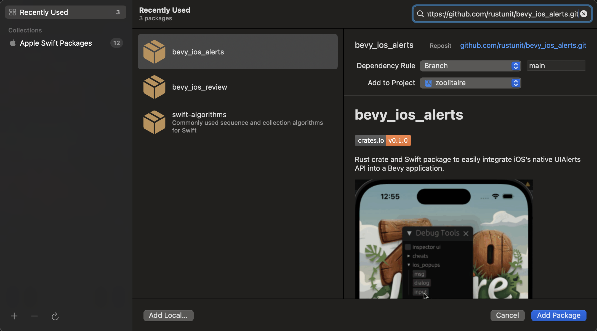

# bevy_ios_alerts

[![crates.io][sh_crates]][lk_crates]
[![docs.rs][sh_docs]][lk_docs]
[![discord][sh_discord]][lk_discord]

[sh_crates]: https://img.shields.io/crates/v/bevy_ios_alerts.svg
[lk_crates]: https://crates.io/crates/bevy_ios_alerts
[sh_docs]: https://img.shields.io/docsrs/bevy_ios_alerts
[lk_docs]: https://docs.rs/bevy_ios_alerts/latest/bevy_ios_alerts/
[sh_discord]: https://img.shields.io/discord/1176858176897953872?label=discord&color=5561E6
[lk_discord]: https://discord.gg/rQNeEnMhus

Rust crate and Swift package to easily integrate iOS's native UIAlerts API into a Bevy application.


demo from our game using this crate: [zoolitaire.com](https://zoolitaire.com)

**See also** [bevy_ios_iap](https://github.com/rustunit/bevy_ios_iap), [bevy_ios_notifications](https://github.com/rustunit/bevy_ios_notifications), [bevy_ios_gamecenter](https://github.com/rustunit/bevy_ios_gamecenter), [bevy_ios_review](https://github.com/rustunit/bevy_ios_review) & [bevy_ios_impact](https://github.com/rustunit/bevy_ios_impact)

## Instructions

1. Add to XCode: Add SPM (Swift Package Manager) dependency
2. Add Rust dependency
3. Setup Plugin

### 1. Add to XCode

Go to `File` -> `Add Package Dependencies` and paste `https://github.com/rustunit/bevy_ios_alerts.git` into the search bar on the top right:


### 2. Add Rust dependency

```
cargo add bevy_ios_alerts
``` 

or 

```
bevy_ios_alerts = { version = "0.2" }
```

### 3. Setup Plugin

Initialize Bevy Plugin:

```rust
app.add_plugins(bevy_ios_alerts::IosAlertsPlugin);
```

Trigger Alert in your application code:

```rust
fn system_triggerin_alerts(mut events: EventWriter<IosAlert>) {
     
    events.send(IosAlert::Message {
        title: String::from("title"),
        msg: String::from("msg"),
        button: String::from("ok"),
    });
     
    events.send(IosAlert::Dialog {
        title: String::from("title"),
        msg: String::from("this is a dialog with multiple buttons"),
        button_yes: String::from("absolutely yes"),
        button_no: String::from("no no no"),
    });
                    
    events.send(IosAlert::Input {
        title: String::from("title"),
        msg: String::from("input box"),
        button: String::from("ok"),
        placeholder: String::from("placeholder"),
    });
}

fn process_alert_response(mut events: EventReader<IosAlertResponse>) {
    for e in events.read() {
        info!("incoming alert response: {e:?}");
    }
}
```

## Bevy version support

|bevy|bevy\_ios\_alerts|
|----|---|
|0.14|0.3,main|
|0.14|0.2|
|0.13|0.1|

# License

All code in this repository is dual-licensed under either:

- MIT License (LICENSE-MIT or http://opensource.org/licenses/MIT)
- Apache License, Version 2.0 (LICENSE-APACHE or http://www.apache.org/licenses/LICENSE-2.0)

at your option. This means you can select the license you prefer.

## Your contributions
Unless you explicitly state otherwise, any contribution intentionally submitted for inclusion in the work by you, as defined in the Apache-2.0 license, shall be dual licensed as above, without any additional terms or conditions.
